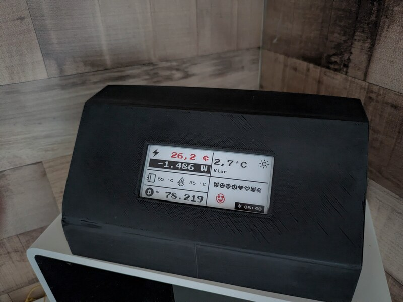
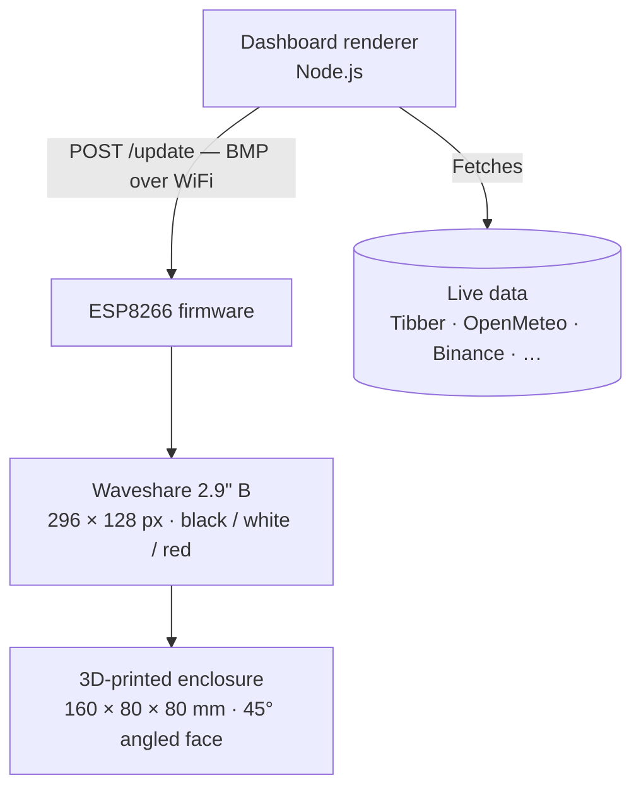

# ink-board

A WiFi-connected tri-color ePaper display that shows a live dashboard — electricity price, solar power, weather, Bitcoin, and more — in a 3D-printed enclosure sitting on your desk.

  

> [!NOTE]
> Most parts of this project — firmware, dashboard renderer, and enclosure design — were created with the help of AI. The whole thing is an experiment in building real hardware with AI assistance.

---

## How it works

1. The **firmware** connects to WiFi and serves a small HTTP API. On boot it shows its IP address on the display.
2. The **dashboard renderer** runs on any machine on the same network, fetches live data from external APIs (Tibber, OpenMeteo, Binance, …), renders a 296 × 128 image, and pushes it to the device every few minutes.
3. The **enclosure** is a 3D-printed shell with a chamfered top edge so the display faces the viewer at a comfortable angle.

---

## Modules

| Module | Description | Docs |
|--------|-------------|------|
| **Firmware** | ESP8266 Arduino sketch — WiFi, HTTP server, ePaper driver | [firmware.instructions.md](.github/instructions/firmware.instructions.md) |
| **Dashboard** | Node.js renderer — data fetching, SVG layout, BMP upload | [README.md](dashboard/README.md) · [dashboard.instructions.md](.github/instructions/dashboard.instructions.md) |
| **Enclosure** | OpenSCAD 3D-printable box with angled display window | [enclosure.instructions.md](.github/instructions/enclosure.instructions.md) |

---

## Hardware

| Part | Details |
|------|---------|
| MCU | ESP8266 (NodeMCU 1.0 / ESP-12E) |
| Display | Waveshare 2.9" B V4 — 296 × 128 px, tri-color (black / white / red) |
| Interface | SPI (hardware) |
| Power | USB via NodeMCU onboard regulator |
| Enclosure | PLA, printed upside-down, no supports needed |
